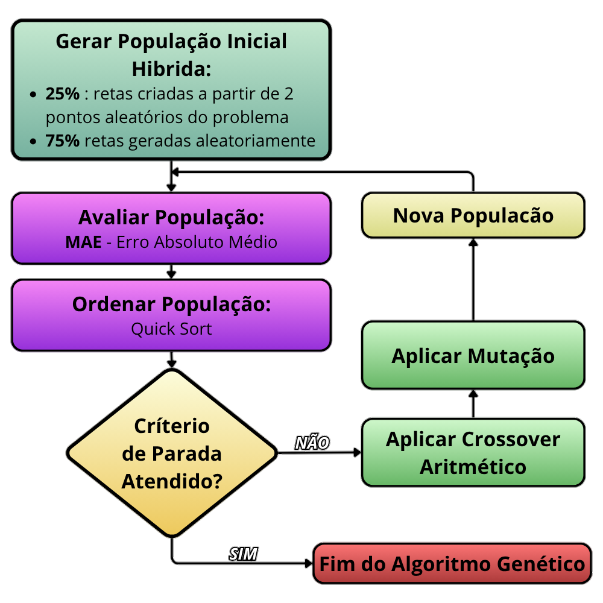

<h1 align="justify">
Algoritmo Genético para Ajuste de Curva 
</h1>

<div align="center">

 
</div>

---

## 📋 Índice
1. [Problema](#problema)
2. [Algoritmo Genético](#algoritmo-genético)
3. [Detalhes de Implementação](#detalhes-de-implementação)
4. [Estrutura do Projeto](#estrutura-do-projeto)
5. [Compilação e Execução](#compilação-e-execução)
6. [Complexidade Computacional](#complexidade-computacional)

---

## Problema

### Objetivo
Este projeto implementa um **algoritmo genético** para resolver um problema clássico de **ajuste de curva linear**. O objetivo é encontrar os coeficientes **a** e **b** de uma reta que melhor se ajusta a um conjunto de pontos (x, y) fornecidos como entrada.

### Formulação Matemática
Dados:
- Um conjunto de pontos: $P = \{(x_1, y_1), (x_2, y_2), \ldots, (x_n, y_n)\}$
- Uma reta linear: $y = ax + b$

Buscar:
- Coeficientes **a** (inclinação) e **b** (intercepto) que minimizem o erro entre os pontos reais e a reta ajustada.

### Função de Fitness (MAE - Erro Absoluto Médio)
A qualidade de uma solução é avaliada através do **Erro Absoluto Médio (MAE)**:

$$\text{MAE} = \frac{1}{n} \sum_{i=1}^{n} |y_i - \hat{y}_i|$$

Onde:
- $y_i$ é o valor y do ponto i
- $\hat{y}_i = a\hat{x}_i + b$ é o valor predito pela reta
- **Objetivo**: Minimizar o MAE (quanto menor, melhor a solução)

<br>

---
## Algoritmo Genético

### Conceitos Fundamentais

O **Algoritmo Genético** é um algoritmo de busca baseado em mecanismos de seleção natural e evolução. A ideia principal é:

1. Iniciar com uma população aleatória de soluções (cromossomos)
2. Avaliar a qualidade de cada solução (fitness)
3. Selecionar as melhores soluções
4. Reproduzir através de crossover (combinação de genes)
5. Aplicar mutação (alterações aleatórias)
6. Repetir até convergência ou número máximo de gerações

### Fluxograma do Algoritmo



---
## Detalhes de Implementação

### Estruturas de Dados

#### 1. Reta
```c
typedef struct {
    float a;  // Inclinação
    float b;  // Intercepto
} reta;
```
#### 2. Cromossomo
```c
typedef struct {
    reta reta;        // Genes: coeficientes a e b
    float fitness;    // Qualidade da solução (MAE)
} cromossomo;
```


#### 3. Parâmetros do Algoritmo Genético
```c
typedef struct {
    int quantidade_individuos;   // Tamanho da população
    int quantidade_geracoes;     // Número de iterações
    
    //Predefinidos
    float taxa_mutacao;          // Taxa de mutação (padrão: 0.05)
    float taxa_crossover;        // Taxa de crossover (padrão: 0.90)
} parametrosAG;
```

### Operadores Genéticos Implementados

#### 1. **Geração da População Inicial (Híbrida)**
- Combina duas estratégias:
  - **25% dos indivíduos**: Gerados a partir de pares aleatórios do dataset
    - Calcula a reta que passa por dois pontos aleatórios do conjunto de dados
    - Garante soluções iniciais próximas à solução ótima
  - **75% dos indivíduos**: Gerados com valores aleatórios
    - Cada coeficiente (a, b) recebe um valor aleatório no intervalo **[-10, 10]**
    - Precisão: até 5 casas decimais
- Esta abordagem híbrida acelera a convergência do algoritmo
- Caso especial: Se o dataset tem apenas 2 pontos, garante pelo menos 1 indivíduo gerado a partir desses pontos (fitness = 0)

**Função**: `gerarPopulacaoInicial()`

#### 2. **Avaliação (Fitness)**
- Cada cromossomo é avaliado calculando o MAE para a reta correspondente
- A avaliação ocorre após cada geração para toda a população

**Função**: `avaliarPopulacaoMAE()` - Calcula o Erro Absoluto Médio de cada indivíduo

#### 3. **Seleção - Quick Sort**
O algoritmo utiliza **qsort()** (ordenação rápida da biblioteca padrão C) para:
- Ordenar completamente a população
- Separar os melhores indivíduos (melhor fitness = menor erro)

**Características**:
- Complexidade: $O(n \log n)$ em média
- Representa o maior custo computacional do algoritmo

**Funções**:
- `qsort()` - Função da biblioteca padrão C (stdlib.h)
- `compararCromossomos()` - Função comparadora para qsort()

#### 4. **Elitismo**
- Os **5% melhores** indivíduos são preservados sem alterações para a próxima geração
- Isso garante que a melhor solução encontrada não seja perdida
- Percentual: `PERC_ELETISMO = 0.05`

**NOTA:** O método de ordenação $Quick Sort$ pode ser substituído por um método de seleção mais eficiente (como $QuickSelect$) para obter os melhores indivíduos em $O(n)$ em média, como também pode ser substituído por um método de seleção por torneio ou roleta para evitar a ordenação completa e reduzir o custo computacional.

#### 5. **Crossover Aritmético**
O crossover combina dois pais para gerar dois filhos:

**Processo**:
1. Selecionar aleatoriamente dois pais diferentes da população selecionada
2. Com probabilidade `taxa_crossover` (90%), aplicar:
   - Gerar um valor aleatório $\alpha \in [0, 1]$
   - Combinar genes usando média ponderada:

$$a_{\text{filho1}} = \alpha \cdot a_{\text{pai1}} + (1 - \alpha) \cdot a_{\text{pai2}}$$
$$b_{\text{filho1}} = \alpha \cdot b_{\text{pai1}} + (1 - \alpha) \cdot b_{\text{pai2}}$$

3. Se a probabilidade falhar (10%), filhos herdam genes dos pais sem alteração

**Função**: `crossoverPopulacao()`

#### 6. **Mutação**
A mutação introduz aleatoriedade na população, evitando convergência prematura:

**Processo**:
1. Para cada indivíduo (exceto elitismo):
   - Com probabilidade `taxa_mutacao` (5%):
     - Escolher aleatoriamente entre alterar **a** ou **b** (50% cada)
     - Adicionar um valor aleatório no intervalo **[-0.2, 0.2]**

$$a_{\text{novo}} = a + \Delta a \quad \text{ou} \quad b_{\text{novo}} = b + \Delta b$$

Onde $\Delta \in [-0.2, 0.2]$ com até 5 casas decimais

**Função**: `mutacaoPopulacao()`

### Fluxo Principal do Algoritmo

```c
// 1. Inicializar
- Ler entrada (pontos e parâmetros)
- Gerar população aleatória
- Inicializar solução

// 2. Para cada geração:
  - Realizar Crossover
  - Realizar Mutação
  - Aplicar Elitismo
  - Avaliar nova população
  - Ordenar população (QuickSort)
  - Armazenar melhor solução
  - Se fitness ≈ 0, parar (solução perfeita)

// 3. Retornar solução com histórico de gerações
```

## Estrutura do Projeto

```
PraticaAEDS/
├── Makefile                    # Script de build: compila, linka e executa o projeto
│
├── README.md                   # Documentação do projeto (estrutura, uso e descrição do AG)
│
├── config/                     # Arquivos de configuração e dados de entrada
│   └── input.dat               # Dataset de entrada: pontos + parâmetros do algoritmo genético
│
├── outputs/                    # Arquivos gerados pela execução
│   └── output.dat              # Resultados do AG (melhor solução, métricas, histórico, etc.)
│
└── src/                        # Código-fonte principal do projeto
    ├── main.c                  # Ponto de entrada: orquestra leitura, execução do AG e saída
    │
    ├── algoritmoGenetico.c     # Implementação do algoritmo genético (seleção, crossover, mutação)
    ├── algoritmoGenetico.h     # Interface do AG e definição das funções principais
    │
    ├── problema.c              # Lógica do problema: avaliação de fitness e cálculos auxiliares
    ├── problema.h              # Definição das structs (reta, ponto, dataset, etc.)
    │
    ├── leitor.c                # Funções de I/O: leitura do input e escrita dos resultados
    └── leitor.h                # Interface das funções de entrada/saída
```

### Descrição dos Arquivos Principais

**main.c**
- Ponto de entrada do programa
- Coordena leitura da entrada, execução do AG e saída dos resultados
- Mede o tempo de execução

**algoritmoGenetico.c/h**
- Implementação completa do algoritmo genético
- Contém todas as operações genéticas (seleção, crossover, mutação)
- Gerencia a evolução da população

**problema.c/h**
- Define estruturas de dados do problema
- Implementa funções matemáticas (MAE, MSE, cálculos de reta)
- Gerencia memória das soluções

**leitor.c/h**
- Lê dados de entrada do arquivo `input.dat`
- Escreve resultados no arquivo `output.dat`
- Interfaceia com o sistema de arquivos

<br>

---
## Compilação e Execução

### Requisitos
- Compilador GCC
- Make
- Sistema operacional Unix/Linux/WSL ou similar

### Comandos Disponíveis

| Comando | Função |
|---------|--------|
| `make` | Compila o programa (gera executável em `build/app`) |
| `make run` | Compila (se necessário) e executa o programa |
| `make clean` | Remove todos os arquivos compilados (limpeza) |
| `make release` | Compila com otimizações (-O3) |


### Formato de Entrada (input.dat)
O arquivo `input.dat` deve conter:
- **Primeira linha**: `n m g` (quantidade de pontos, quantidade de indivíduos e quantidade de gerações)
- **Próximas `n` linhas**: `x y` (coordenadas dos pontos)

**Exemplo**:
```
4 10 50
0 1
1 3
2 5
3 7
```

### Formato de Saída (output.dat)
O arquivo `output.dat` contém os resultados:
- Melhor fitness encontrado
- Reta final: coeficientes a e b
- Fitness e reta por geração (histórico completo)
- Tempo de execução

---

### Características Notáveis
✅ Implementação eficiente usando qsort() ($O(n \log n)$ em média) <br>
✅ Elitismo para preservação de melhores soluções <br>
✅ Crossover aritmético para combinação inteligente <br>
✅ Mutação adaptativa com intervalo controlado <br>
✅ Convergência precoce se solução perfeita for encontrada <br>
✅ Histórico completo de evolução por geração <br>

<br>

---
## Complexidade Computacional

**Notação**:
- $n$ = Quantidade de indivíduos (tamanho da população)
- $g$ = Quantidade de gerações
- $p$ = Quantidade de pontos no dataset

### Análise por Operação

| Função | Complexidade | Descrição |
|--------|-------------|-----------|
| `gerarPopulacaoInicial()` | $O(n)$ | Geração híbrida: 25% do dataset, 75% aleatório |
| `crossoverPopulacao()` | $O(n)$ | Combina genes de dois pais |
| `mutacaoPopulacao()` | $O(n)$ | Altera valores com taxa 5% |
| `avaliarPopulacaoMAE()` | $O(n \cdot p)$ | Calcula fitness para cada indivíduo |
| `qsort()` | $O(n \log n)$ | Ordena população por fitness |
| **`algoritmoGenetico()`** | **$O(g(n \cdot p + n \log n))$** | Complexidade total por geração |

## Convergência para $O(g \cdot n \log n)$

Na prática, **o ordenamento da população via `qsort()` é a operação dominante**, responsável por $O(n \log n)$ a cada geração. Por isso, a complexidade asintótica converge para:

$$\boxed{O(g \cdot n \log n)}$$

Onde cada uma das $g$ gerações executa uma ordenação de $n$ elementos em $O(n \log n)$.

<br>

## Informações Adicionais

### Disciplina
Algoritmos e Estruturas de Dados (AEDS)

### Professor
[Michael Pires Silva](https://github.com/mpiress)

### Data
05/04/2026
## Autor

<table>
  <tr>
    <td align="center">
      <br>
      <b>Alisson H. Gomes</b><br>
        <a href="https://github.com/alisson-h" target="_blank">Git Hub</a> 
    </td>
  </tr>
</table>
